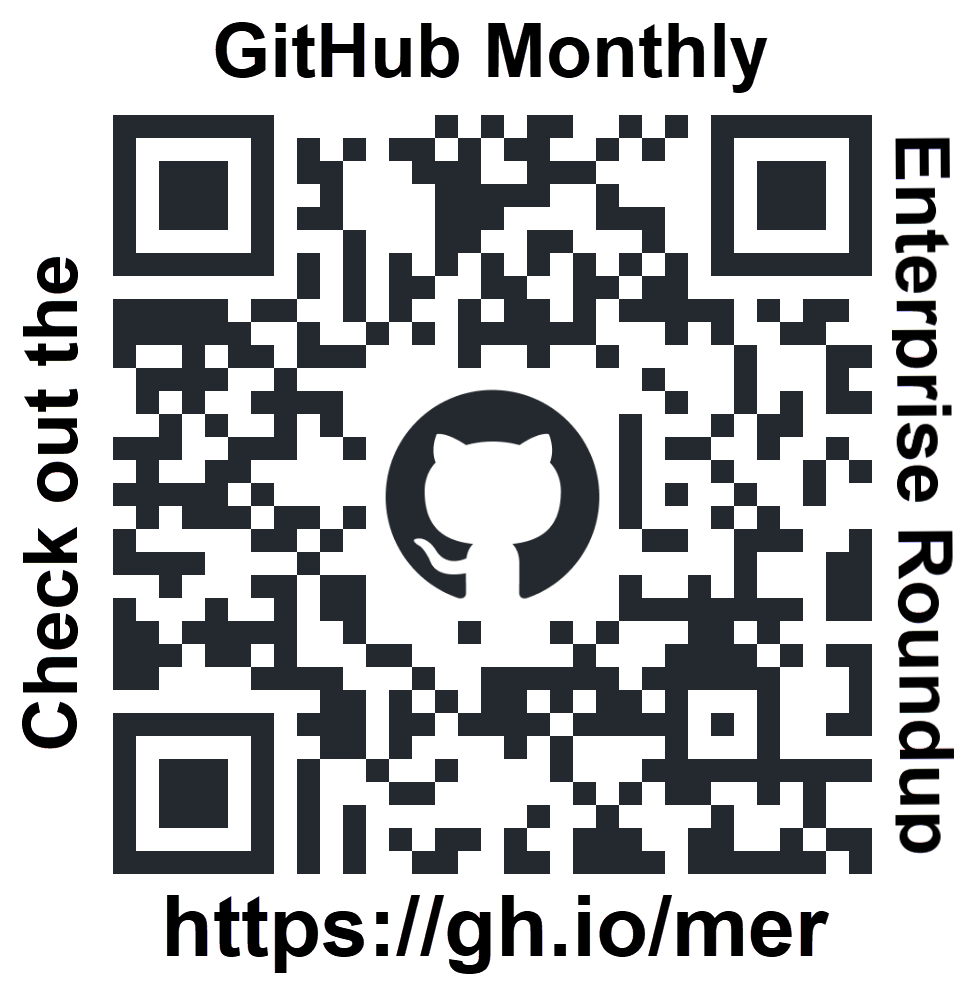
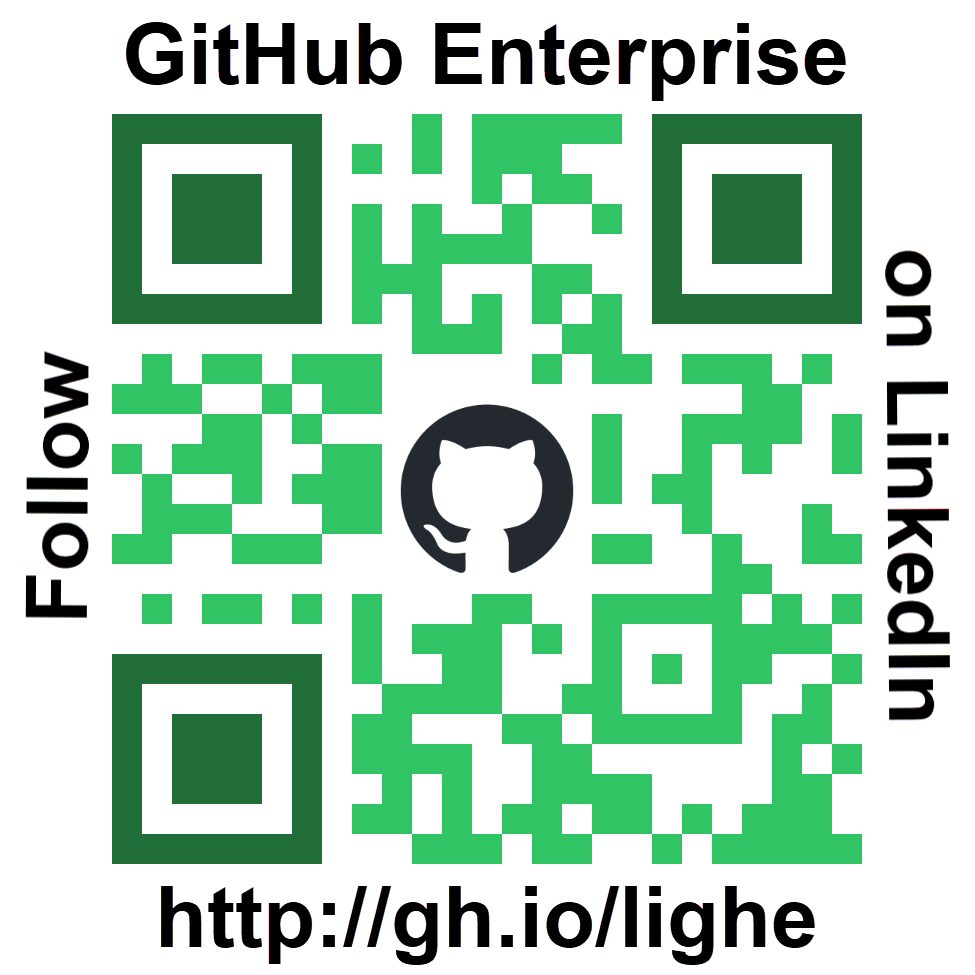

### DevOps is to software development what the assembly line is to automobile manufacturing. And, it is the logistics to get software to end users like delivery logistics get vehicles to dealers. 

#### What does this mean for your organization? If you setup a secure, efficient, robust, resilient assembly line you will innovate faster than your competition!

# About Me 🙋🏻‍♂️

I am a **Senior DevOps Advocate** on the **GitHub Enterprise Advocates Team**. I am is very passionate about DevOps and application modernization. I am a link between the product group and customers and I have led executive briefings with leaders from 100’s of GitHub’s enterprise customers. I joined Microsoft in January 2016 and moved over to GitHub in 2020. I have spent time as a consultant and in technical sales prior to joining the product group. I have been focused on DevOps the entire time.

I have worked in the software development industry my entire career. Having worked for both startups and large companies, my strength is my view and knowledge of the overall software development lifecycle paired with technical skills which allow me to manage DevOps culture,  processes & tools that enable software development teams to become as innovative, efficient and productive as possible.

## Past Events 🗣️

### Microsoft Build 2026
+ [Azure DevOps meets GitHub, the path to AI powered SDLC](https://build.microsoft.com/en-US/sessions/BRK202) 2026-06-03 - Azure DevOps and GitHub are better together—and the integration keeps getting smarter. In this demo-heavy session, you’ll see how hybrid patterns that connect GitHub with Azure Boards and Azure Pipelines enable Agentic DevOps. See the all of the newest AI-powered capabilities in Azure DevOps. Plus, hear how Microsoft's engineering teams adopted this approach and what they gained. (Co-presented with [Dan Hellem | LinkedIn](https://www.linkedin.com/in/danhellem/))

### Microsoft Ignite 2025 
+ [**AI-powered workflows with GitHub and Azure DevOps**](https://ignite.microsoft.com/en-US/sessions/BRK106?source=sessions) 2025-11-18 - Modernize your DevOps strategy with Agentic DevOps by migrating your Azure Repos to GitHub while continuing to leverage the investments you’ve made in Azure Boards and Azure Pipelines. We’ll walk through real-world patterns for hybrid adoption, show how to integrate GitHub, Azure Boards and Azure Pipelines, and share best practices for enabling agent-based workflows with the MCP Servers for Azure DevOps. (Co-presented with [Dan Hellem | LinkedIn](https://www.linkedin.com/in/danhellem/))

### Microsoft Build 2025 
+ [**Making Azure DevOps and GitHub Greater than the Sum of their Parts | BRK110**](https://build.microsoft.com/sessions/BRK110) [YouTube ](https://youtu.be/gch8n74yCgY?si=hkZ_ldrnNDNji1Gy) 2025-05-21 - The latest and upcoming features for Azure DevOps and GitHub will simplify your workflows. Use GitHub repositories, Copilot, Codespaces, and Code Security to enhance developer productivity, while maintaining continuity with your existing Azure Boards, Pipelines, and Test Plans for enterprise-scale development. Make GitHub Copilot context aware of Azure DevOps through the new MCP server for Azure DevOps. (Co-presented with [Dan Hellem | LinkedIn](https://www.linkedin.com/in/danhellem/))

### Webinars
+ [**2026-02-24 AI-powered workflows with GitHub and Azure DevOps**](https://developer.microsoft.com/en-us/reactor/events/26641/) Learn how to connect GitHub and Azure DevOps for a seamless AI powered DevOps workflow. See step-by-step examples of hybrid adoption, integration best practices, and how agent-based automation can boost your team’s speed and reliability. Bring your DevOps investments together for faster delivery and less friction. Access a PDF of the slides, including numerous links to resources here: [AI-powered workflows with GitHub and Azure DevOps - 2026-02-24.pdf](https://github.com/DaveBurnisonMS/Presentations/blob/main/AI-powered%20workflows%20with%20GitHub%20and%20Azure%20DevOps%20-%202026-02-24.pdf). (Co-presented with [Dan Hellem | LinkedIn](https://www.linkedin.com/in/danhellem/))
+ [**2025-12-09 JFrog and GitHub: The Future of Agentic Software Delivery Across Source & Binaries**](https://watch.jfrog.com/jfrog/jfrog-and-github-automated-next-level-devsecops) - Most DevSecOps pipelines separate source and binary management and security, leaving gaps that increase risk and slow development. In this webinar, discover how JFrog and GitHub deliver a deeply integrated experience that unifies source and binary security in one workflow. (Co-presented w/ [Yonatan Arbel, Sr. Developer Advocacy Lead | LinkedIn](https://www.linkedin.com/in/yonatan-arbel/))
+ [**2025-06-26 Doubling Down on Security: JFrog and GitHub Deliver Unified Code and Binary Advanced Security**](https://events.actualtechmedia.com/on-demand/2678/doubling-down-on-security-jfrog-and-github-deliver-unified-code-and-binary-advanced-security) - Join experts from GitHub and JFrog as they reveal how their integrated, advanced security solutions work in tandem to deliver unparalleled protection, from the first line of code to production. This joint session will explore how GitHub and JFrog Advanced Security combine to form a unified DevSecOps powerhouse, providing deep visibility, layered protection, and operational efficiency without compromising developer velocity. (Co presented w/ [Bill Manning, Sr. Solution Architect | LinkedIn](https://www.linkedin.com/in/williammanning/))

### Other Recent Presentations
+ You'll find my most recent Meetup & User Group presentations at https://GitHub.com/DaveBurnisonMS/Presentations.

## Awards 🏅

| Badge | Description |
|----------|----------|
|  | In 2022 Dave was awarded the [Microsoft Executive Briefing Center’s (EBC) Distinguished Speaker award](https://www.credly.com/badges/4b33b5be-f559-4b92-8650-fe525621be84). Distinguished Speaker is the highest achievement Microsoft has at the EBC. This award recognizes speakers who embody all attributes of EBC and customer engagement best practices. |
|  | In 2026 Dave was awarded the [FY26 Experience Center EC - One One Microsoft Award Winner](https://www.credly.com/badges/5d8e823f-22a1-424a-a1a1-a9f14ba17cc8). This award recognizes speakers who step outside of their individual business, product, or technology area to demonstrate solutions across the platform. Your exceptional dedication is reflected in the consistent impact you deliver, the breadth of your contributions, and the strong, trusted relationships you build. Your work plays an important role in strengthening customer connections and advancing Microsoft’s continued success. |
|  | In 2025 Dave was awarded the [Microsoft Executive Briefing Center’s (EBC) Executive Briefing Speaker Champion Award](https://www.credly.com/badges/26a0da30-8b67-4115-84e2-62adf72ac849/public_url). This Speaker Engagement Champion Program Award celebrates the dedication & impact of speakers. This initiative recognizes individuals who consistently contribute to customer engagements based on cumulative delivery milestones. **Dave has delivered over 200 Executive Briefings in the Microsoft EBC**. The program draws on historical data dating back to 2013 and is designed to spotlight active speakers who help shape Microsoft’s customer narrative. |
|  | In 2025 Dave was awarded the [Microsoft Executive Briefing Center’s (EBC) One Microsoft award](https://www.credly.com/badges/2c7808b7-4157-40e8-a624-16263835beca/public_url). This award recognizes speakers who step outside of their individual business, product, or technology area to demonstrate solutions across the platform. His exceptional dedication shines through in his outstanding customer and engagement owner satisfaction scores, and number of deliveries. |
|  | In 2024 Dave was awarded the [Microsoft Executive Briefing Center’s (EBC) Performance Excellence award](https://www.credly.com/badges/7a5b1361-8f26-41d5-8b76-15189717d7bc/public_url). The award winners for this category represent our best speakers based on feedback from customers, NSAT scores, and number of deliveries over the year. |

# Check out the GitHub Monthly Enterprise Roundup (MER)
GitHub is shipping new features, product updates, and best practices faster than ever. To help you keep up with all our releases, previews, videos, whitepapers, new documentation, etc. check out our **Monthly Enterprise Roundup (MER)**. Our goal with the **MER** is provide one source for discovering everything that is new from an enterprise perspective. Want to get notified of when the next **MER** is available? Go to **GitHub Enterprise** on **LinkedIn** and click on the "Follow" button. 

Share this with your teams and stakeholders so they can also get the most out of their GitHub experience. 

| GitHub Monthly Enterprise Roundup (MER) |          | Follow **GitHub Enterprise** on **LinkedIn** to be notified of each new post |
|---------|---------|---------|
|  |          |  |
